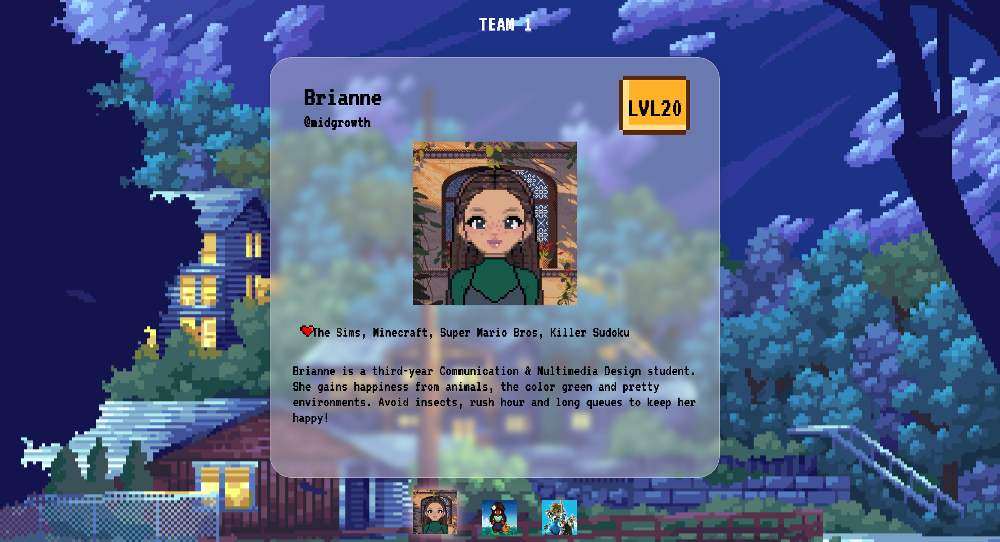
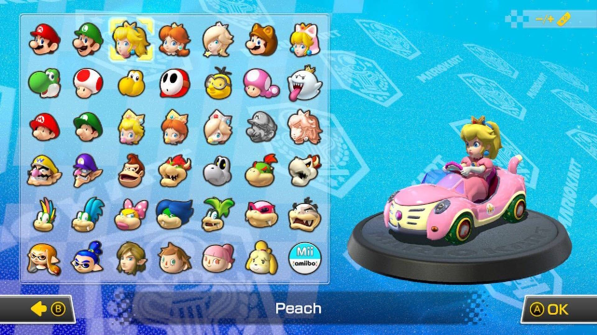
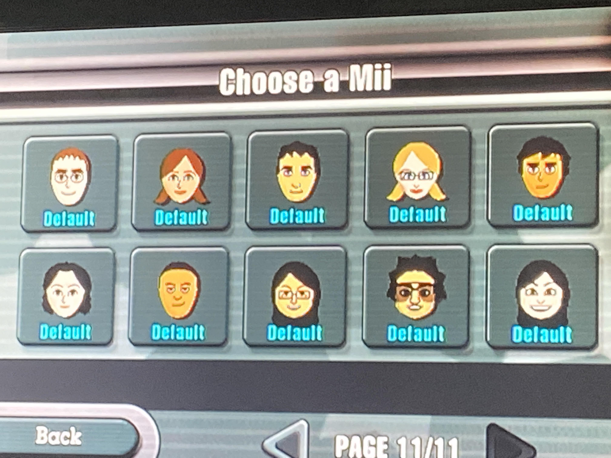
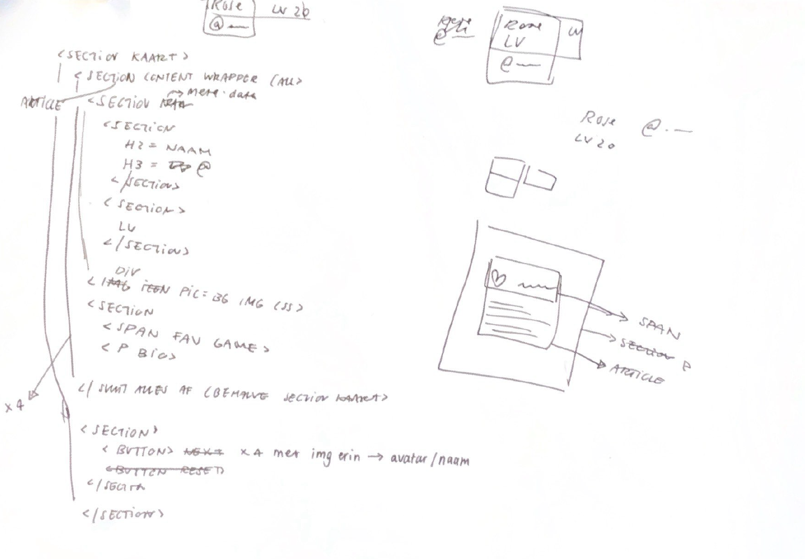
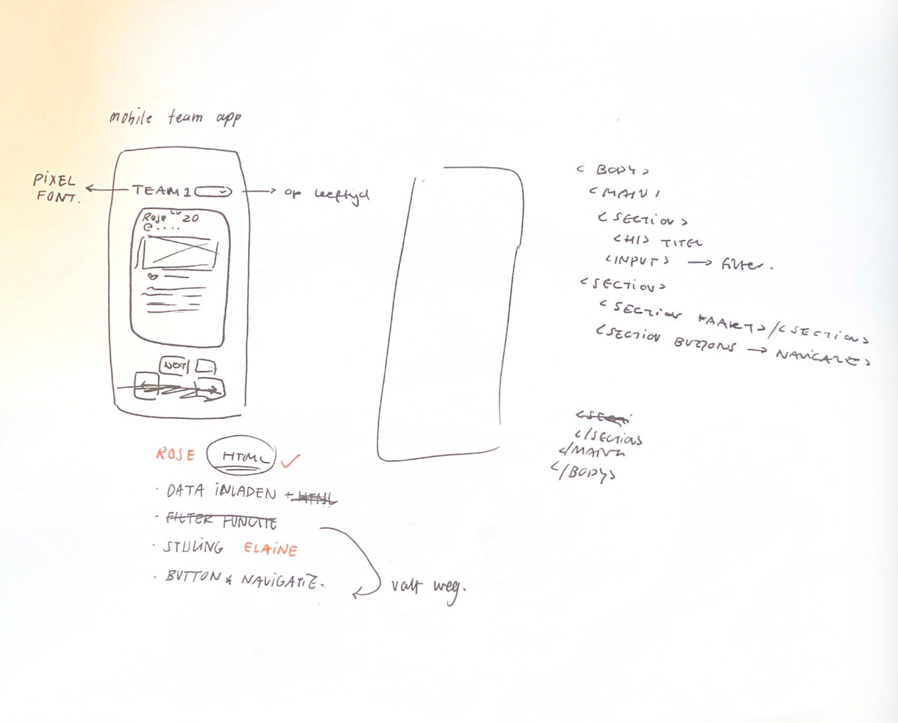
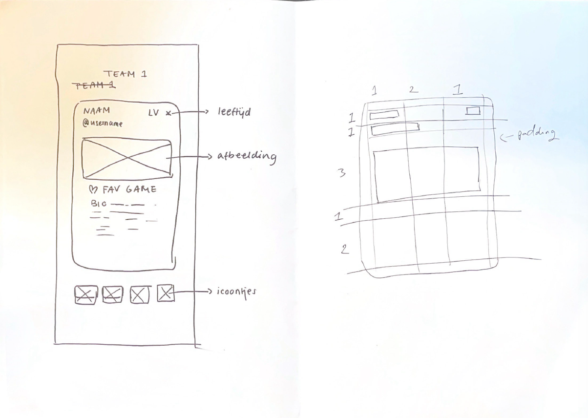

# TEAM APP - BRIANNE, ELAINE AND ROSE

  

Welcome to the team app for the course Webapps From Scratch of the minor Web Design & Development. As a team, we have a shared love for videogames - from the classic Nintendogs and Super Mario Bros to puzzle games like Sudoku and Nonograms. It was kind of a given that we'd channel this shared love into a team application that introduced who we are as retro video game characters.

**Table of contents:**

 - [Installation Guide](#installationguide)
 - [Concept and Team Roles](#conceptteamroles)
 - [Coding Standards](#codingstandards)
 - [Data Fetching and Handling](#datafetchinghandling)
 - [Message from Collaborators](#messagefromcollabs)

 <a id="installationguide"></a>

 ## Installation Guide

 Want to install our app? Here's a comprehensive guide on how to do so. If you don't want to go through the trouble, [our app is also live](https://briannededeugd.github.io/web-app-from-scratch-2324-team/).

1. Navigate to the `Code` tab of this repository.
2. Click the green button that says `Code` at the top right of the files section.
3. At the bottom of the dropdown that appears, click `Download ZIP`.
4. Open your computer's Finder (or its alternative, dependent on your operating system) and navigate to the folder you've downloaded the ZIP into, this is usually `Downloads` by default.
5. Locate the newly downloaded ZIP (its name will be `web-app-from-scratch-2324-team`) and unpack it.
6. Find the file `index.html` in the unpacked ZIP's docs folder, right-click this file and open with Chrome or Firefox.
    1. Alternatively: open the folder in VSCode or another code editor and click `Go Live` at the bottom right. The app will open automatically.

There you go, now you've installed the app!

 <a id="conceptteamroles"></a>

 ## Concept and Team Roles

 Our concept was to make some kind of character game card that displayed a character's characteristics. We originally planned to make a stack of four cards, but found that it would be more interesting to dynamically change displayed elements based on user interactions. We extracted inspiration from the games we grew up with in way of designing the interface, and decided to use our avatars as selection buttons, a pattern popularized by games like Mario Cart and the Wii's Mii's:

 

 [Mario Kart Characters source](https://www.pockettactics.com/mario-kart/characters)
 [Mii's Source](https://www.reddit.com/r/punchout/comments/o8jbxg/has_anyone_else_noticed_these_miis_when_you/)

 We created a rough sketch together and planned out the HTML in class.

  

  Next, we divided the tasks between us:
  - Brianne: Initial setup, retrieving data, scripts & styling
  - Elaine: CSS planning, styling
  - Rose: HTML planning, HTML building, styling

  <a id="codingstandards"></a>

 ## Coding Standards

 To make sure our code styles aligned and we wouldn't run into unnecessary merge conflicts caused by formatting differences, we set up some coding standards.

 _Formatting_<br />
 1. Indentation is one tab, or four spaces;
 2. The tab indentation can not be overridden;

 _Pushing and Pulling_<br />
 1. Everybody works on their own branch, which is named after them;
 2. No commits can be pushed to the main branch without being reviewed and approved by another collaborator;
 3. Commit messages start with their code, begin with a capital letter and are written in imperative language ('gebiedende wijs' in Dutch)
    1. CODES:
        1. INIT - Initial commit / changes;
        2. ADD - A change in the file structure, like (re)moving files or adding them;
        3. FEAT - A new feature added to the app;
        4. STYLE - Styling the app;
        5. README - Documentation;
        6. COM - Comments for clarification

  <a id="datafetchinghandling"></a>

 ## Data Fetching and Handling

 As soon as we were able to fork the team repository, Brianne did so and worked on fetching the correct data. She started by filling the `team.json`-file with her own relevant links, just to test. First, she made all variables she expected to need:

```js
let members = [];

const memberData = {
    brianne: {},
    elaine: {},
    rose: {},
    ruud: {},
};
```

Then, she fetched the members from `team.json` and filled the members array with what was returned:

```js
fetch("./team.json")
	.then((response) => response.json())
	.then((teamdata) => {
		members = teamdata.members;
		loadMemberData(members);
		console.log("TEAM MEMBERS:", members);
	});

```

She then tied the data from each member to their name in the memberData object. This made sure that each member's data could easily be accessed using memberData.[theirname].[thepropertyneeded].

```js
function loadMemberData(members) {
	members.forEach((member) => {
		const dataURL = `${member.personalPage}`;

		fetch(dataURL)
			.then((response) => {
				if (!response.ok) {
					throw new Error("Network response was not ok");
				}
				return response.json();
			})
			.then((data) => {
				// Directly assign the fetched data to the correct variable based on the member's name
				Object.assign(memberData[member.name], data);
				console.log(`${member.name}`, data); // Logs the data per member

				// Set background image here after data is loaded
				const buttons = [brianneButton, roseButton, elaineButton, ruudButton];

				buttons.forEach((button) => {
					button.style.backgroundImage = `url("${
						memberData[button.id].avatar_url
					}")`;
				});
			})
			.catch((error) => console.error("Error when loading the data:", error));
	});
}
```

Now, the data was accessed, sorted and useable!

  <a id="messagefromcollabs"></a>

  ## Message From Collaborators

  Big thanks for checking out our project! This README is representative of the short, but impactful journey we've embarked on as we built our teamapp, the story of our adventure full of code, mild stress, and a lot of head-scratching. We’ve had our ups and downs, but that’s only realistic. Seeing each other actually contribute to this project and working together as smoothly as we did is pretty much the coolest thing ever.
  
 Let’s keep the code flowing and the good times rolling.
 
 Sincerely,
 Brianne, Elaine and Rose `<3`